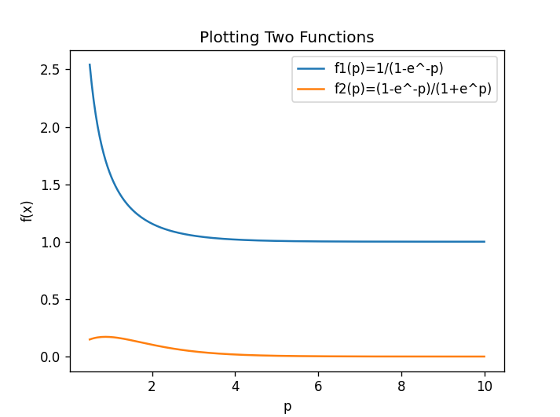

# Experiment 1b


### Code 1

##### Program

```python
frame_len = int(input("Enter the length of the frame: "))
b_str = input("Enter the binary string: ")
# Zero-padding
b_str = '0'*(frame_len-(len(b_str)%frame_len)) + b_str  if (len(b_str) % frame_len != 0) else b_str
b_len = len(b_str)
# converting to dictionary
b_dic = {key:b_str[i:i+frame_len] for i,key in zip(range(0,b_len,frame_len),range(b_len//frame_len))}
print(f"The binary string is: {b_str}\nThe framed dictionary is: {b_dic}")
def exOR(a, b) -> str: return ''.join(['1' if a[i] != b[i] else '0' for i in range(frame_len)]) #XOR function
# Calculating XOR of all the keys in the dictionary using list comprehension
b_xor=''
[b_xor:= exOR(b_dic.get(i) if b_xor=='' else b_xor,b_dic.get(i+1))  for i in range((b_len//frame_len)-1)]
print(f"the XOR of the framed value is {b_xor}")
```

##### Output

```python
Enter the length of the frame: 5
Enter the binary string: 110110101010101010101
The binary string is: 0000110110101010101010101
The framed dictionary is: {0: '00001', 1: '10110', 2: '10101', 3: '01010', 4: '10101'}
the XOR of the framed value is 11101
```

### Code 2

##### Program

```python
import numpy as np
import matplotlib.pyplot as plt

def fun1(p):  # 1/(1-e^-p)
    return (1/(1-np.exp(-p)))

def fun2(p): # (1-e^-p)/(1+e^p)
    return (1-np.exp(-p))/(1+np.exp(p))

p = float(input("Enter value of p: "))
xlist = np.linspace(0.5,p,num=200)
ylist1 = fun1(xlist)
ylist2 = fun2(xlist)
#Plotting
plt.figure(num=0,dpi=120)
plt.plot(xlist,ylist1,label="f1(p)=1/(1-e^-p)")
plt.plot(xlist,ylist2,label="f2(p)=(1-e^-p)/(1+e^p)")
plt.title("Plotting Two Functions")
plt.xlabel("p")
plt.ylabel("f(x)")
plt.legend()
plt.show()
```

##### Output

```python
Enter value of p: 10
```


